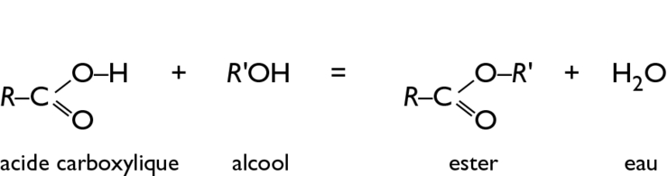
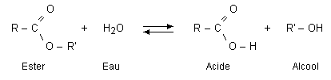
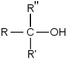
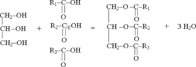
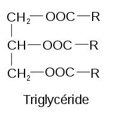
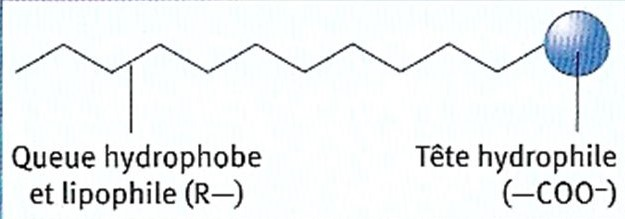
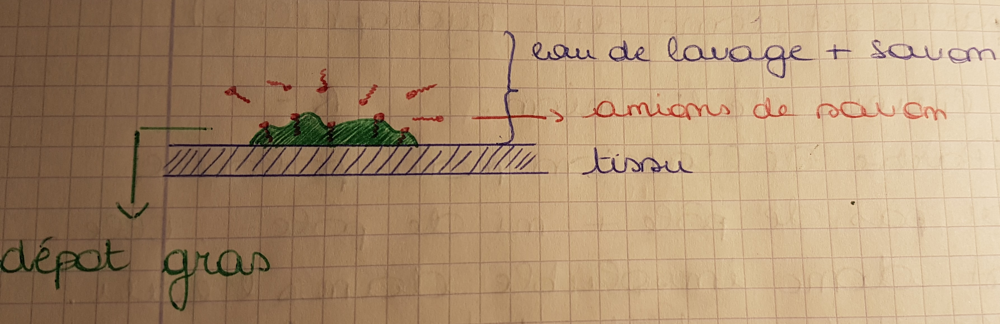
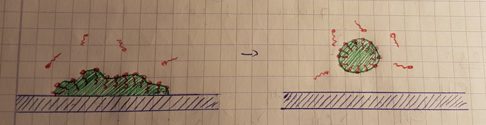

======
Chimie
======

1. Esterification

1.1 Introduction

|image|

  La réaction d’esterification est une réaction incomplète. Il rest dès
lors des 2 réactifs. On peut donc supposer que la réaction inverse se
produit en même temps.

L’ester réagit avec l’eau pour formé de l’acide carboxylique et de
l’alcool. Cette réaction inverse est appelée l’hydrolyse d’un ester.

|image|

1.2 Réactions réversibles

  Les réactions d’esterification et d’hydrolyse d’un ester peuvent être
qualifiées de réversibles puisqu’elles engendrent dans les mêmes
conditions et simultanément la réaction inverse.

1.3 Fonctions alcool et acide

2.4902in Fonction alcool

Fonction acide carboxylique

Règles de nomenclatures ;

1° Il faut numéroter la chaîne carbonnée principale càd la plus longue
qui contienne la fonction alcool ou acide.

|image|

2° Le sens de numérotation de la chaîne principale est choisi de telle
manière que le C qui porte la fonction ait le plus petit numéro
possible.

3° Nommer la chaîne principale en s’appuyant sur l’alcane correspondant
en accolant le suffixe « -ol » ou «acide  … -oïque» avec la position du
groupement s’il s’agit d’un alcool ( fonction acide toujours en 1er).

|image|

4° Ajouter devant le nom obtenu les groupements alkyles s’il y en a.

1.3 Nomenclatures des esters

|image|

Le nom des esters s’obtient en remplaçant la terminaison -ique des noms
usuels des acides par -ate et en précisant le nom du groupement alkyle
R2.

Remarque : Loi de Guldberg et Wooge

Dans un système d’équilibre

.. math::

   \mathit{aA}+\mathit{bB}\Leftrightarrow
   \mathit{xX}+\mathit{yY}\mathit{o\text{ù}}a,b,x,y\mathit{sont}\mathit{des}\mathit{co\text{é}fficients}\mathit{stochiom\text{é}triques}

Il existe un rapport constant, K, qu’on peut calculer sur base des
concentrations. Kc est la constante d’équilibre.

.. math::

   K_c=\frac{[X]^x\ast [Y]^y}{[A]^a\ast
   [B]^b}\mathit{avec}[]\mathit{qui}\mathit{est}\mathit{la}\mathit{concentration}\text{à}l'\mathit{\text{é}quilibre}\mathit{et}\mathit{en}\mathit{mol}/L

2. Saponification

2.1 Les lipides

Ce sont des triesters formés par le métabolisme cellulaire à partir de
glycérine et d’acide gras (acide carboxylique + longue chaîne carbonée).
 La nomenclature des acides gras est la même que pour l’acide
carboxylique.

Equation générale de la formation du triglycéride

3.8398in Glycérine +  3 Acide gras    =          triester          + eau

|image|

Formule générale d’un triglycéride :

|image|

  Parmis les lipides, on distingue les huiles et les graisses.  Les
huiles : Origine végétale. À T° ambiante, elles sont liquides et R1, R2,
R3  contiennent une ou plusieurs doubles liaisons. Ces molécules sont
insaturées ou polyinsaturées et donc sensible à l’oxydation par l’air.
Les lipides polyinsaturées diminuent le mauvais cholestérol et la
tension artériel.

Les graisses : Origine animal. À T° ambiante, elles sont solides.  R1,
R2, R3  ne contiennent que de simples liaisons. Ces molécules sont
saturées. Les lipides saturées augmentent le mauvais cholestérol.

2.2 Molécules de l’hygiène

Une réaction de saponification est une réaction entre un triglycéride et
une hydroxyde alcalin, menant à la formation de glycérine et un savon.

Triglycéride + hydroxyde Glycérine + savon

Le savon est un sel organique. Si NaOH alors c’est un savon dur et si
KOH alors c’est un savon liquide.

Quand les savons sont mis en solution aqueux, les savons se dissocient
en cations métalliques (K+, Na+) et un anion organique à longue chaîne
de carbone : R-COO-. Cet anion est contisué de 2 parties qui se
comportent très différement vis à vis de l’eau.  

-  La tête de l’anion (-COO-) est la partie polaire de l’anion, celle
   qui est susceptible de créer des ponts hydrogènes aveec les molécules
   d’eau.

-  La queue de l’anion (R-) est insoluble dans l’eau. Elle est donc
   hydrophobe.

|image|

2.3 Pouvoir détergent et mode d’action

|image|

Les queues non-polaires des anions s’associent aux longues chaînes
carbonnées non-polaires des lipides.

|image|

Les anions vont favoriser le décollement des triglycérides.Il se forme
ainsi des assemblages moléculaires appelés micelle. Une micelle est un
assemblage de molécules toutes semblables entourées de structure avec
une exrémité hydrophile et une autre hydrophobe. Les micelles sont
chargées négativement à leur surface, elles se repoussent donc entre
elles, se dispersent dans tout le liquide et sont évacuées dans l’eau de
rinçage.

2.4 Limite d’éfficacité des savons

Dans l’eau de distribution sont présents à concentrations très variables
d’une région à l’autre d’ios Ca²+ et Mg²+. Plus cette concentration est
grande, plus l’eau est dites dure.Cela influence l’éfficacité du savon.
Dans une eau dure, le pouvoir détergent du savon diminue à cause de la
réaction suivante :

.. math:: 2\mathit{RCOO}_{(\mathit{aq})}+\mathit{Ca}_{(\mathit{aq})}=(\mathit{RCOO})\mathit{Ca}_{(s)}\mathit{avec}(\mathit{RCOO})\mathit{Ca}_{(s)}\mathit{qui}\mathit{est}\mathit{un}\mathit{pr\text{é}cipit\text{é}}\mathit{donc}\mathit{pas}\mathit{soluble.}

Le savon ne pourra développer son pouvoir détergent qu’après
précipitation complète des cations Ca²+ et Mg²+. Il faut donc mettre
plus de savon pour nettoyer du linge dans une eau dure.

3. Les réactions de précipitation

3.1 Définition

Une réaction de précipitation est une réaction qui aboutit à un produit
solide très peu soluble appelée un précipité.

Une solution saturée est une solution dans laquelle le volume de solvant
a dissous le maximum de soluté (tout ajout de soluté reste non dissout).

Solubilité est la quantité maximale de soluté dissout à T° donné par
Litre de solution, c’est aussi la concentration du soluté dans une
solution saturée notée « s » et exprimée en mol/L ou en g/L.

3.2 Composés solubles et peu solubles

On considère soluble un composé dont la solubilité est supérieur à 0,1
mol/L et donc on considère comme peu soluble un composé dont la
solubilité est inférieur à 0,1 mol/L. On qualifie souvent d’insolubles,
les composés peu solubles.

À Retenir :

-  

   -  Tous les Nitrates (NO3) sont solubles.

   -  Tous les sels d’ammonium (NH4), de sodium (Na) et de potassium
      (K)sont solubles

3.3 Réactions de précipitation

Ecriture ionique :

  Ag+(aq) + NO3-(aq) + Na+(aq) + Cl-(aq) Na+(aq) +  NO3-(aq) + AgCl(s)

  Ag+(aq)  + Cl-(aq)  AgCl(s)

Na+(aq)  et NO3-(aq) sont des ions spéctateurs, ils ne réagit pas dans
la réaction. Ils ne sont pas indispensables.

Ecriture moléculaire :

AgNO3 (aq) + Na Cl(aq) NaNO3 (aq) + AgCl(s)

3.4 Produit de solubilité et quotient réacionnel

.. math::

   \mathit{aA}+\mathit{bB}\Leftrightarrow
   \mathit{xX}+\mathit{yY}\mathit{o\text{ù}}a,b,x,y\mathit{sont}\mathit{des}\mathit{co\text{é}fficients}\mathit{stochiom\text{é}triques}\mathit{et}A,B\mathit{sont}\mathit{solides}

.. math::

   K_{\mathit{ps}}=[X]^x\ast
   [Y]^y\mathit{avec}K_{\mathit{ps}}\mathit{qui}\mathit{est}\mathit{produit}\mathit{de}\mathit{solubilit\text{é}}\mathit{de}\mathit{XY}

Astuce : Lorsqu’il y a le même nombre de moles dans les deux produits,
on peut directement comparer l’expression de leur Kps.

3.5 Quotient réacionnel

.. math::

   \mathit{aA}+\mathit{bB}\Leftrightarrow
   \mathit{xX}+\mathit{yY}\mathit{o\text{ù}}a,b,x,y\mathit{sont}\mathit{des}\mathit{co\text{é}fficients}\mathit{stochiom\text{é}triques}\mathit{et}A,B\mathit{sont}\mathit{solides}

.. math::

   Q_{\mathit{ps}}=(\mathit{Ci}_X)^x\ast
   (\mathit{Ci}_Y)^y\mathit{avec}Q_{\mathit{ps}}\mathit{qui}\mathit{est}\mathit{quotient}\mathit{r\text{é}actionnel}\mathit{et}\mathit{Ci}\mathit{sont}\mathit{les}\mathit{concentrations}\mathit{initiales}

Si Qps > Kps, alors il y a précipitation sinon Qps < Kps et donc il n’y
a pas de précipitation.

Rappel :

Modification de la Concentration :

 Un composé ajouté est en partie consommé ( Augmentation de la
concentration des réactifs ()              (Augmentation de la
concentration des produites (←)

 Un composé ajouté est en partie reformée ( Diminution de la
concentration des produits ()                       (Diminution de la
concentration des réactifs (←)

Modification de la Température :

Augmentation de la température favorise la réaction endothermique
(Dépends du sens du delta H) Diminution de la température favorise la
réaction exothermique (Dépends du sens du delta H)

Modification de la pression :

Augmentation de la pression favorise la réaction qui va vers le moins de
moles de gaz (Dépends du sens de la réaction )

Diminution de la pression favorise la réaction qui va vers le plus de
moles de gaz (Dépends du sens de la réaction )  

