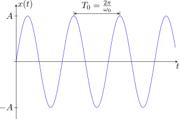
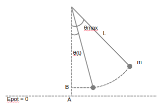
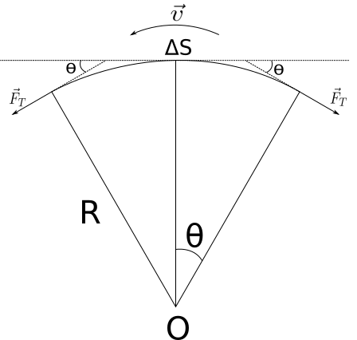

===============================
Physique Oscillation Harmonique
===============================

:Author: Vanden Driessche Théo
:Date:   November 2017

   :format: html latex

.. toctree::
   :maxdepth: 2
   :caption: Contents:

   physique
   Exercice-Entrainement-exam
   PhysiqueFormule

Phènomènes périodiques
======================

Définitions
-----------

| -Un oscillateur est un objet décrivant un mouvement de va-et-vient de
  part et d’autre d’une position d’équilibre.
| -L’élongation y d’un point P est la valeur algébrique de l’écart de P
  par rapport à la position d’équilibre O.

Caractéristiques d’une oscillation
----------------------------------

Période et fréquence
~~~~~~~~~~~~~~~~~~~~

.. math::

           f&=\dfrac{1}{T} \Longleftrightarrow &T=\dfrac{1}{f} \\
           f& \Rightarrow Hz &T \Rightarrow s 

Mouvements Harmoniques
======================

Définition
----------

| Un mouvement harmonique est un mouvement d’oscillation dont la
  représentation graphique de l’élongation en fonction du temps est une
  sinusoïde.

Amplitude
---------

| -L’amplitude est l’écart maximal par rapport à la position d’équilibre
  c’est à dire l’élongation maximale. On la note A l’unité SI est le
  mètre (m).
| L’amplitude correspond à la position maximale\ 
  :math:`A = y_{(t)max}`\
| La période T coresspond au temps mis par oscillation.
| La frequence f correspond au nombre d’oscillation par seconde.

Étude mathématique
------------------

| Supposons d’abord que la position :math:`M_{0}` du point M à l’instant
  t=0 se situe sur CX, à droite de C. L’angle :math:`\alpha` formé par
  CX et CM, qui vaut 0 à l’instant t = 0, augmente régulièrement puisque
  M tourne à vitesse constante.
| La vitesse angulaire est l’angle balayé par CM par unité de temps. La
  notation est :math:`\omega`. L’unité SI est le radian/seconde (rad/s).

  .. math:: \omega = \dfrac{\alpha}{t} \text{ ou } \alpha=\omega \cdot t

| de M décrit un mouvement d’oscillation de part et d’autre de C. La
  valeur algébrique de CP est l’élongation. On voit que\ 
  :math:`-A \leqslant y \leqslant A`\
| La période T de P est la durée d’une oscillation complète, ce qui
  correspond à un tour complet. Par consequent,
  :math:`\alpha _{(T)}=2\pi` .
| Or :math:`\alpha=\omega \cdot t` donc
  :math:`\alpha _{(T)}=\omega \cdot T = 2\pi`
| :math:`y_{(t)} = CP = QM = CM \cdot sin(\alpha) = A \cdot sin(\omega t)`

Dynamique
=========

.. math::

   \begin{aligned}
   \Rightarrow \sum F & = -m\omega ^2 y \\
   \text{ Où }  -m\omega ^2 & \text{ est constant.}\end{aligned}

Rappel: Loi d’Hooke
-------------------

.. math::

   \begin{aligned}
       F = -kx\end{aligned}

Toute force de ce type provoque un mouvement d’oscillation harmonique
par consequent: la période peut être déduite de la relation

.. math:: \omega = \sqrt{\dfrac{k}{m}}

.. math:: T = 2 \pi \sqrt{\dfrac{m}{k}}

Le pendule simple
-----------------

| Que peut faire varier la période d’un pendule simple?
| -Son Energie de départ (E)
| -La longeur de la corde (L)
| -la pesanteur (g)

Epot
~~~~

.. math::

   \begin{split}
       E_{tot} & = E_{pot} + E_{cin} \\
       & = mg|AB| \\
       & = mg(L-Lcos(\theta_{(t)})) \\
       & = mgL(1-cos(\theta_{(t)}))
   \end{split}

Ecin
~~~~

.. math::

   \begin{aligned}
   E_{cin} & = \dfrac{mv^2}{2}  & v = v_{ang}L \\
   &     & = \theta ' _{(t)}L & \text{ la dérivée de l'angle décrit} \\
   & = \dfrac{m(\theta ' _{(t)} L)^2}{2}\\\end{aligned}

Etot
~~~~

| Energie totale est constante (Frottements négligeables).
| Donc la variation d’Etot = 0. Par conséquent, sa dérivée vaux zéro.
| 

  .. math:: (E_{tot})'=0

| Nous pouvons donc dire:

  .. math::

         (E_{pot})'  & = (E_{cin} + E_{pot})' \\
         0 & = \Bigg( \dfrac{m(\theta_{(t)}' L)^2}{2} + mgL\Big(1-cos(\theta_{(t)})\Big)\Bigg)' \\
         & = \Bigg( \dfrac{m(\theta_{(t)})'^2 L^2}{2} + mgL\Big(1-cos(\theta_{(t)})\Big)\Bigg)' \\
         & = \dfrac{2}{2}mL^2 \theta_{(t)} ' \theta_{(t)}'' + mgLsin(\theta_{(t)})\theta_{(t)}' \\
         & = L \theta_{(t)}'' + y\cdot sin(\theta_{(t)}) \\
         \theta_{(t)}'' & =\dfrac{ -y\cdot sin(\theta_{(t)})}{L}
   
.. math::

   \text{Si, } \theta < \dfrac{\pi}{6} \text{ ,on a } sin(\theta) \cong \theta \text{ alors,}\\
   \theta_{(t)}'' + \dfrac{g}{L} \theta_{(t)} = 0
   
| 

| Une solution de cette équation différentielle, où l’on suppose que
  :math:`\omega^2 = \dfrac{g}{L}`, est:
| 

  .. math:: \theta_{(t)} = \theta_{max} sin(\omega t + \varphi)

| 

  .. math::

         \omega^2 & = \dfrac{g}{L} 
         & \omega = \sqrt{\dfrac{g}{L}}&
         &\dfrac{2\pi}{T}  = \sqrt{\dfrac{g}{L}}\\
         T & = \dfrac{2\pi \sqrt{\dfrac{g}{L}}L}{2}
         & T = 2\pi \sqrt{\dfrac{L}{g}} &

Energie
-------

Énergie cinétique
~~~~~~~~~~~~~~~~~

.. math::

   \begin{split}
       E_{cin}  = \dfrac{mv^2}{2} & = \dfrac{m\Big(\omega A \cdot cos(\omega t+ \varphi)\Big)^2}{2} \\
       & =\dfrac{ m\omega^2 A^2 cos^2(\omega t+ \varphi)}{2} \text{ Par l'égalité fondamentale: } \\
       & = \dfrac{ m\omega^2 A^2 \Big(1-sin^2(\omega t+ \varphi)\Big)}{2} \\
       & =\dfrac{m\omega^2\Big(A^2-A^2sin^2(\omega t+ \varphi)\Big)}{2} \\
       & =\dfrac{m\omega^2(A^2-y_{(t)}^2)}{2} \\
       & = \dfrac{k(A^2-y_{(t)}^2)}{2}
   \end{split}

Énergie totale
~~~~~~~~~~~~~~

| L’énergie totale est égale à l’énergie cinetique lorsque
  :math:`y_{(t)}=0`
| 

  .. math::

     \begin{split}
              E_{tot} & = E_{cinMax}\\
             & = \frac{kA^2}{2}
          \end{split}

Énergie potentielle élastique
~~~~~~~~~~~~~~~~~~~~~~~~~~~~~

| Par définition, :math:`E_{pot} = E_{tot}-E_{cin}`
| 

  .. math::

     \begin{split}
             E_{pot} & = E_{tot}-E_{cin} \\
             & = \frac{kA^2}{2} - \dfrac{k(A^2-y_{(t)}^2)}{2} \\
             & = \frac{k(A^2-A^2+y_{(t)}^2)}{2} \\
             & = \frac{ky_{(t)}^2}{2}
         \end{split}

Oscillations amorties
---------------------

| Il existe des forces dissipatives, :math:`E_{mec}` n’est pas
  conservée. Ceci entraine une diminution de l’Amplitude (A) au fil du
  temps (t).
| En general, :math:`F_{dissip}=\gamma \cdot v` où :math:`\gamma` est
  une constante d’amortissement.

Résonance
=========

Définitions
-----------

-  lorsque le transfet d’énergie est maximum, on dit qu’il y a
   résonance.

Conclusions
-----------

#. Il y a résonance lorsque la fréquence propre du résonateur est égale
   à la fréquence propre de l’excitateur

#. Le transfert d’énergie a donc un caractère sélectif: le résonateur
   absorbe de façon préférentielle à sa fréquence propre.

Application mathématique
------------------------

.. math:: k= \dfrac{F_p}{x}=\dfrac{m\cdot g}{x}

Ondes progressives
==================

Définition
----------

Transfert d’énérgie sans transfert de matère.

Types
-----

-  Ondes transversales

-  Ondes longitudinales

Vitesse
-------

Dépend du milieu et de la nature du signal

Ondes sinusoïdales entretenues
------------------------------

Longueur d’onde
~~~~~~~~~~~~~~~

.. math:: \lambda = v \cdot T = \dfrac{v}{f}

Distance minimale entre 2 points en concordance de phase.

Études mathématiques
~~~~~~~~~~~~~~~~~~~~

Prenons l’équation en fonction du temps de l’élongation de S (la source)
et supposons que :math:`\varphi = 0`

.. math:: y_{S(t)}= A \cdot sin(\omega t)

|

P fait la même chose que S avec avec un retard qui correspond au temps
mis pour arriver à P.

.. math::

   \begin{split}
           y_{P(t)} & = A \cdot sin(\omega t + \phi) \\
           &= A \cdot sin(\omega (t-t')) \text{ où } t' = \dfrac{d}{v}\\
           &= A\cdot sin\Big(\omega t - \omega \dfrac{d}{v}\Big)\\
           &= A \cdot sin\Big(\omega t - \dfrac{2\pi}{T}\cdot \dfrac{d}{v}\Big) \\
           &= A \cdot sin\Big(\omega t - \dfrac{2\pi d}{\lambda}\Big) \text{ valable pour } t > t'
       \end{split}

Conditions pour que P et S vibrent en concodrance de phase.

.. math::
            k2\pi &= \dfrac{2\pi d}{\lambda} \\

   \begin{split}
           y_{S(t)} &= y_{P(t)}  \text{ et même v}\\
           A\cdot sin(\omega t) &= A\cdot sin\Big(\omega t - \dfrac{2\pi d}{\lambda}\Big)\\
            sin(\omega t) &= sin\Big(\omega t - \dfrac{2\pi d}{\lambda}\Big)\\
            \omega t &= \omega t - \dfrac{2\pi d}{\lambda} + k2\pi \\
            0 &=  - \dfrac{2\pi d}{\lambda} + k2\pi \\
            k\cdot \lambda& = d \text{  } k \in \mathbb{N}
       \end{split}

Conditions pour que S et P soient en oppositions de phase.

.. math::

   \begin{split}
           y_{S(t)} &= -y_{P(t)}\\
           A\cdot sin(\omega t) &= -A \cdot sin\Big(\omega t - \dfrac{2\pi d}{\lambda}\Big)\\
           \omega t &= \omega t - \dfrac{2\pi d}{\lambda} + \pi + k2\pi\\
           \dfrac{2\pi d}{\lambda}& = \pi + k2\pi\\
           \dfrac{2 d}{\lambda}& = 1+2k\\
           d&= (2k+1)\cdot \dfrac{\lambda}{2} \text{ } k \in \mathbb{N}\\
       \end{split}

Vitesses des ondes progressives le long d’une corde
~~~~~~~~~~~~~~~~~~~~~~~~~~~~~~~~~~~~~~~~~~~~~~~~~~~

Dans un référentiel qui se déplace avec l’onde, c’est la corde qui se
déplace vers la gauche.

|

|

Un petit segment de corde :math:`\Delta S` peut être assimilé à un arc
de cercle.

.. math:: \Delta S = R(2 \theta)

Si :math:`\mu` est la densité de masse linéique (la masse par mètre
(kg/m)), la masse du segment est:

.. math:: m=\mu \Delta S= \mu R(2\theta)

La tension de la corde doit fournir la force centripète nécessaire au
mouvement circulaire.

.. math::

   \begin{split}
           2F_T \cdot sin(\theta) &= \dfrac{mv^2}{R}
       \end{split}

Si l’amplitude de la déformation est petite, 
:math:'sin(\theta)\cong \theta' , alors,

.. math::

   \begin{split}
           2F_T \cdot sin(\theta) &=  2\mu R \theta \cdot \dfrac{v^2}{R}\\
           v &= \sqrt{\dfrac{F_T}{\mu}}
       \end{split}

